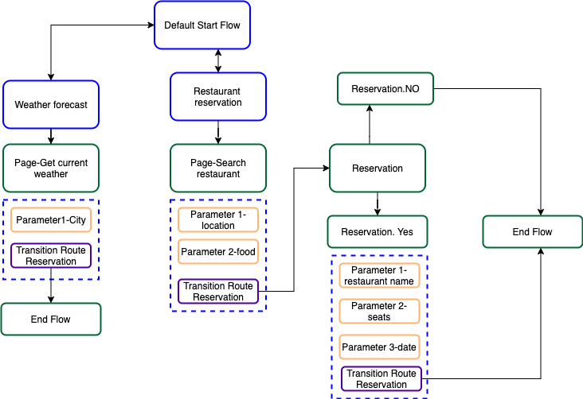

# Dialogflow-CX-Start-Tutorial

### Content
- ##### [Introduction](#intro)
- ##### [Dialogflow CX Setup ](#Setup)
- ##### [Creating a simple welcome message](#welcomemessage)
- ##### [Managing Flows & Pages](#FlowsandPages)
- ##### [Reusing information between flows](#reuseinformation)
- ##### [Building a webhook](#webhook)
- ##### [Conclusion](#conclu)


## <a name="intro"></a>Introduction
This guide shows how to use the Dialogflow CX Console to build and test a simple demo agent. When interacting with this agent, you can ask for getting the weather forecast information, search for a restaurant and make a table reservation. Your completed agent for this guide will be graphed by the console like the following:


## <a name="Setup"></a>Dialogflow CX Setup 
1. To use services provided by Google Cloud, you need to create a project using [Google Cloud Console](https://console.cloud.google.com/) and enable the Dialogflow API.
2. Using [DF-CX console](https://dialogflow.cloud.google.com/cx/projects), choose the project you just created and click Create agent.<br>
3. Complete the form for basic agent settings:<br>
   - You can choose any name.<br>
   - Select your preferred location. <br>
   - Select your preferred time zone.<br>
   - Select "English" as default language for your agent.<br>
4. Click Save.<br> 

## <a name="welcomemessage "></a>Exploring the created agent 
The created agent has a default Start Flow with a start page that comes with default welcome intent. Within this default setting, the agent can handle a basic conversation with only a welcome message.


<b><i>To test your new agent</i></b>:
1. Click the Test Agent button to open the simulator.
2. Enter hello in the text entry and press enter. The agent responds with a default welcome response.
3. Close the simulator 

<b><i>To edit the welcome response message</i></b>:
1. Click the Build tab.
2. Select the Default Start Flow in the Flows section.
3. Click the Start node in the graph. This is the start page for the Default Start Flow.
4. Find the intent route with the Default Welcome Intent and click it. This opens a panel to edit the intent route information.
5. Find the fulfillment section and delete all response messages, then add "Hello, I am here. How I can help you?" as the only response.
6. Click Save and Close the intent route editing panel.
7. Test the updated welcome response message.

## <a name="FlowsandPages"></a>Managing Flows & Pages
So far, the agent has one flow with the start page. In this section, we will add two flows that handle requests about the weather forecast and restaurant reservations. The design of these flows is like the following:


<b> Weather forecast flow: </b> allows users to ask about weather forecast in a given city. Before building it, we need to create the intent that once matched, the flow will be called to handle the user request. <br>
<b>Create intent: </b>
1. Select the Manage tab.
2. Click Intents, click Create, enter weather.current as an intent name and enter the training phrases in [utterances.text](https://github.com/hayo03/Dialogflow-CX-Start-Tutorial/blob/main/intents/GetWeather.txt).
3. For each phrase that contains a city, annotate the city with a parameter named "city" and @sys.geo-city as entity type and Click Save.

<b>Create Flow : </b> 
1. Select the Build tab.
2. Click Flows.
3. Click Create and enter Weather forecast as a flow name. 

<b>Create Page : </b> <br>
By default, the Weather forecast flow has a special page named Start. When a flow initially becomes active, this page becomes the current active page. A start page does not have parameters or response messages like normal pages. So we need to create pages that will collect city information from user and handle his/her request (i.e., provide answers to the user). <br>
 1. Click on "Start" page in Weather forecast flow 
 2. Click the add + button in the Pages section.
 3. Enter "Get current weather" as a display name for the page.
 4. Click the settings more_vert button next to the page display name and select Edit.
 5. Create a new parameter:<br>
   - Parameter name: city<br>
   - Entity type: @sys.geo-city<br>
   - Check "Required"<br>
   - Fulfillement (Agent says): What is the city?<br>

<b> Create Routes: </b> <br> 
As you notice there is no link between different flows (i.e., Default Start Flow and Weather forecast Flow) and the newly created page (get current weather). Without those links, the conversation between bot and user can not be handled. Therefore, Routes are introduced to define such links. We need to define three routes as follows: 
1. Create a Route that transitions from the default start flow to  Weather forecast flow. This route should be called when the end-user asks for weather forecast. To create this route:  <br>
  - Select the Default Start Flow in the Flows section.
  - Click the Start node in the graph. 
  - Add the following intent route:
      - Intent: weather.current
      - Transition: choose Flow  and select “Weather forecast” flow
  - Click Save

2. Create a Route that transitions from the start page of the Weather forecast flow to "Get current weather" page. This route should be called when the intent “weather.current” is matched”. To create this route: <br> 
   - Select the Weather forecast” Flow in the Flows section.
   - Click the Start node in the graph. 
   - Add the following intent route:
       - Intent: weather.current
       - Transition: choose Page  and select “Get current weather” page
    - Click Save

3. Create a route that transitions from “Get current weather" page to End Flow page: this route should be called when all parameters are fulfilled. To create this route: <br> 
   - Select the "Weather forecast” Flow in the Flows section.
   - Click the Start node in the graph. 
   - Add the following intent route:
       - condition: $page.params.status="FINAL"
       - Fulfillement (What the Agent will answer to the user):  There is clear sky in $session.params.city
       - Transition: choose Page  and select “End Flow” page
   - Click Save

Congratulations! Now you can test your agent to test if your flow is correctly created:

<b> Test the Weather forecast flow: </b><br>
1. Click the Test Agent button to open the simulator.<br>
2. Enter "What does the weather forecast look like?" and press enter.<br>
3. The agent will request you to provide the city and then provides you the weather forecast.<br>

## Exercice
Create and test the Restaurant reservation flow. [Here](https://github.com/hayo03/Dialogflow-CX-Start-Tutorial/tree/main/Exercice) we provide some guidance steps.
## <a name="reuseinformation"></a>Reusing information between flows
After completing both flows, the agent will be able to handle user requests about both weather forecast and restaurant reservation. However, when you interact with the agent, you will notice that it may ask you for information that you already provided. As shown below, the agent asks the user "what is your location" despite the fact that he already provided his/her city in one of the previous turns. <br> 

<p align="center">
  
</p>

To avoid such an issue, the agent needs to exploit the context well, i.e.,  any information that can be leveraged from the previous conversation turns or any other sources (e.g., user profile). In this tutorial, we are interested in exploiting the previous conversation turns as the main source for the context. Indeed, in Dialogflow CX,  there is an interesting feature called Parameter preset (in the fulfillment section) that allows to set or override the parameter values. So we will exploit this feature in order to reuse information from session parameters that represents the parameters fulfilled in the previous turns. To do so : <br>
1. Select “Get current weather” page in Weather forecast flow and edit the already defined route.
2. Find Parameter preset feature within the fulfillment section.
3. Click on Add Parameter and add the following:
   - Parameter: location; 
   - Value: "$session.params.city" 
4. Follow the similar steps and add (Parameter: city; Value: "$session.params.location") in “Search restaurant” page.
5. Test again the agent, what do you notice? 
## <a name="webhook"></a>Building a webhook
At this point, the created agent  can answer users only with static response messages. But in real cases, we need to generate dynamic responses, validate collected data, or trigger actions on the backend.  Webhooks are introduced to handle all of this.  They are simply the backend parts of the agent. The agent is the frontend part.


As the diagram above shows, when a fulfillment  that has a webhook is called, the Dialogflow API sends a webhook request to the webhook service.
The webhook service receives the webhook request and takes any actions necessary, like calling external APIs, querying or updating a database, etc. It builds a response and sends a webhook response back to Dialogflow API. A webhook can be created in any server side programming language like Python, PHP or Node.js. We are going to use Python to create a webhook and Ngrok to deploy it using Ngrok. Let’s start building our own webhook for handling weather forecast requests. 

## Install Python 3 
Download and install Python from [Here](https://www.python.org/downloads/)
## Editor: 
You can use gedit or [Visual studio code](https://code.visualstudio.com/download)
## Creating a webhook service using Python
Create a folder and name it (e.g. webhook_service). Under this folder, we are going to create the following two files: webhook.py, API_crendentials.json. 
- webhook.py: it is the webhook service that will handele the requests sent from the agent and provide back a response. We are going to use Flask (a light-weight python web framework ) for creating a webhook.

```
import json
from flask import request, jsonify, make_response
from flask import Flask
from flask import Response
import requests

app = Flask(__name__)

#definition of functions 

if __name__ == '__main__':
    app.run(host="0.0.0.0", port=8081, debug=True)
```

To handle the requests from the agent, we have to add a route in the router and define the function (s) that will be executed when the endpoint is hit:

```
@app.route('/my_webhook', methods=['POST'])
def post_webhook_dialogflow():
    body = request.get_json(silent=True)
    #The tag used to identify which fulfillment is being called.
    fulfillment = body['fulfillmentInfo']['tag']
    slots = []
    for key, value in body['sessionInfo']['parameters'].items():
        slots.append({'name':key,'value':value})
       
    print (slots)
    # msg = 'hi'
    msg = invoke_api(fulfillment, slots)
    return answer_webhook(msg)
```
- invoke_api (fulfillment, slots_values_list): defines actions that should be executed for a given fulfillment. To keep it simple, we have one action that makes call to the [Open wetather API](https://openweathermap.org/api) to get current weather condition for a givin city.
```
def invoke_api(fulfillment, slots):
    print("\n\n\n\n\n=========> CALL API ",fulfillment)
    if fulfillment == "GetWeather_fulfillment":
        for slot in slots:
             if slot['name']=="city":
                 q=str(slot['value'])
        appid=getAPI_credential('api.openweathermap','appid')
        url = 'http://api.openweathermap.org/data/2.5/weather?q='+q+'&appid='+appid
        result = requests.get(url)
        jsonResult = result.json()
        if result.status_code == 200:
            weatherCondition = jsonResult['weather'][0]['description']
            reply = "There is {} in there.".format(weatherCondition)
            print(reply)
            return reply
        else:
            return "Something wrong with the API."
```
- answer_webhook(msg, session_id):  return the answer to the agent in json format.
```
def answer_webhook(msg):
    message= {"fulfillment_response": {
      
        "messages": [
        {
          "text": {
            "text": [msg]
          }
        }
      ]
    }
    }
    return Response(json.dumps(message), 200, mimetype='application/json')
```
Check [here](https://github.com/hayo03/Dialogflow-CX-Start-Tutorial/blob/main/webhook%20service/webhook.py) for the full webhook script that we've built.

- API_crendentials.json: contain credential information needed to make calls to the [Open wetather API](https://openweathermap.org/api). We put our own credential information but you can get your own credential information and put them in this file. Getting credential information requires creating an account in this API.
```
 "api.openweathermap":
         {
         "appid":"put here your openweathermap API key"
        },
```
## Run the webhook service
Once you get the required credentials and complete API_credentials.json file, open terminal, create a virtual environment and install required packages.
 - Operating system: macOS/OS X, Linux; 
```
pip install virtualenv
cd webhook_service
virtualenv -p python3 myenv
source myenv/bin/activate
pip install -r requirements.txt
python webhook.py
```

- Operating system: Windows:

```
cd webhook_service
python3 -m venv myenv
myenv\Scripts\activate.bat
pip install -r requirements.txt
python webhook

```


## Deploy a webhook service using Ngrok
Ngrok is a web tunneling tool that provides a way to test webhooks from local server. Download it from [here](https://ngrok.com/download), unzip it, and in the terminal just run the following commends:

```
cd Ptah_To_Ngrok
./ngrok http 8081 (or ngrok http 8081 if the first one does not work)

```

## Setup webhook in Dialogflow and test it
We need to first create a webhook and add it to the fulfillment in "Get Weather" page:
1. Create webhook 
   - Select the Manage tab.
   - Click Webhooks and click Create.
   - Enter your webhook url generated by ngrok, some thing like https://2f4168d1c17d.ngrok.io/my_webhook.
   - Click Save.
2. Add a webhook to a fulfillment
   - Click on "Get Weather" page
   - Click on the exsiting route 
   - find the fulfillment section and Check "Use Webhook"
   - Select "my_webhook_service" and enter "GetWeather_fulfillment" in tag field. 
3. To test the webhook, click the Test Agent and enter "What does the weather forecast look like?". If everything is well settled, the agent should provide you the weather forecast in the given city.

## <a name="conclu"></a>Conclusion
There are other interesting agent settings that we haven't covered, including integrations and event handlers. Overall, this tutorial covers most of the Dialogflow CX basics that every bot developer should be well-versed in toward building conversational agents doted with advanced capabilities.
