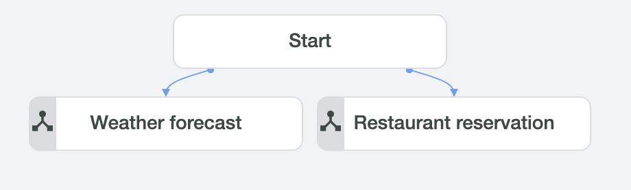
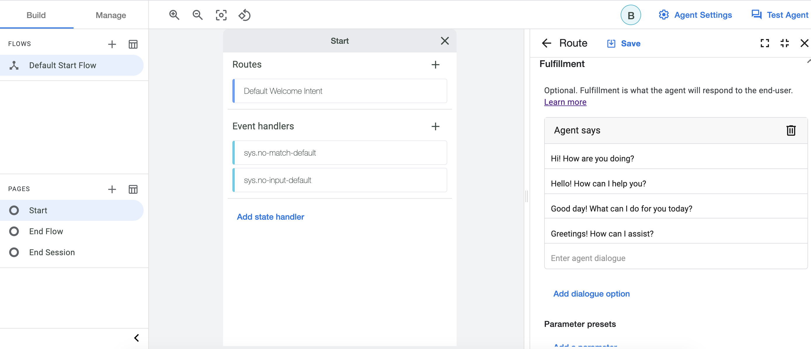
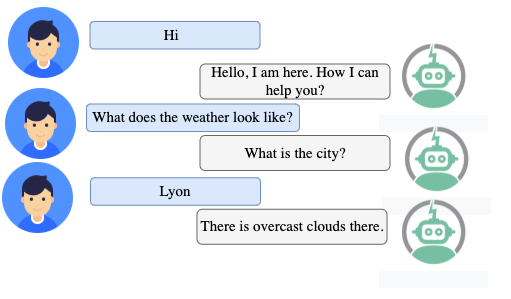
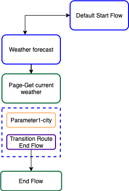
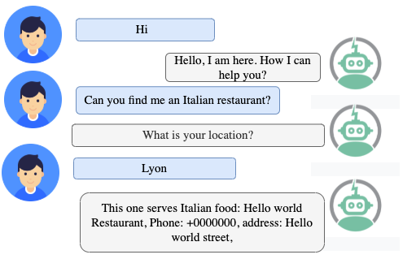
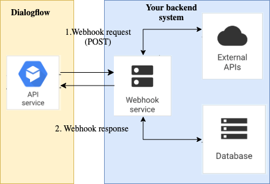

# Dialogflow-CX-Start-Tutorial

### Content
- ##### [Introduction](#intro)
- ##### [Environnement Installation](#install)
- ##### [Dialogflow CX Setup ](#Setup)
- ##### [Exploring the created agent](#welcomemessage)
- ##### [Managing Flows & Pages](#FlowsandPages)
- ##### [Exercise](#exercise)
- ##### [Building a webhook](#webhook)
- #####[Designing more complex conversations](#complexconversations)
- ##### [Conclusion](#conclu)


## <a name="intro"></a>Introduction
This guide shows how to use the Dialogflow CX Console to build and test a simple demo agent. When interacting with this agent, you can ask for getting the weather forecast information, search for a restaurant and make a table reservation. Your completed agent for this guide will be graphed by the console like the following:

<p align="center">
  
</p>

## <a name="install"></a>Environnement Installation 
During this tutorial, we will need to use Python as a programming language, visual studio code to write code, and Ngrok to deploy webhook services in localhost. [Here](https://github.com/hayo03/Installation) are the steps to install all of these.
## <a name="Setup"></a>Dialogflow CX Setup 
1. To use services provided by Google Cloud, you need to create a project using [Google Cloud Console](https://console.cloud.google.com/) and enable the Dialogflow API.
2. Using [DF-CX console](https://dialogflow.cloud.google.com/cx/projects), choose the project you just created and click Create agent.<br>
3. Complete the form for basic agent settings:<br>
   - Name it "Demo-agent" <br>
   - Select your preferred location. <br>
   - Select your preferred time zone.<br>
   - Select "English" as default language for your agent.<br>
4. Click Save.<br> 

## <a name="welcomemessage"></a>Exploring the created agent 
The created agent has a default Start Flow with a start page that comes with default welcome intent. Within this default setting, the agent can handle a basic conversation with only a welcome message.



<b><i>To test your new agent</i></b>:
1. Click the Test Agent button to open the simulator.
2. Enter hello in the text entry and press enter. The agent responds with a default welcome response.
3. Close the simulator 

<b><i>To edit the welcome response message</i></b>:
1. Click the Build tab.
2. Select the Default Start Flow in the Flows section.
3. Click the Start node in the graph. This is the start page for the Default Start Flow.
4. Find the intent route with the Default Welcome Intent and click it. This opens a panel to edit the intent route information.
5. Find the fulfillment section and delete all response messages, then add "Hello, I am here. How I can help you?" as the only response.
6. Click Save and Close the intent route editing panel.
7. Test the updated welcome response message.

## <a name="FlowsandPages"></a>Managing Flows & Pages
So far, the agent has one flow with the start page. In this section, we will add another flow that handle requests about the weather forecast. The design of this flow is like the following:

<p align="center">
    
</p>

<b> Weather forecast flow: </b> allows users to ask about weather forecast in a given city. Before building it, we need to create the intent that once matched, the flow will be called to handle the user request. <br>
<b>Create intent: </b>
1. Select the Manage tab.
2. Click Intents, click Create, enter weather.current as an intent name and enter the training phrases in [utterances.text](https://github.com/hayo03/Dialogflow-CX-Start-Tutorial/blob/main/intents/GetWeather.txt).
3. For each phrase that contains a city, annotate the city with a parameter named "city" and @sys.geo-city as entity type and Click Save.

<b>Create Flow : </b> 
1. Select the Build tab.
2. Click Flows.
3. Click Create and enter Weather forecast as a flow name. 

<b>Create Page : </b> <br>
By default, the Weather forecast flow has a special page named Start. When a flow initially becomes active, this page becomes the current active page. A start page does not have parameters or response messages like normal pages. So we need to create pages that will collect city information from user and handle his/her request (i.e., provide answers to the user). <br>
 1. Click on "Start" page in Weather forecast flow 
 2. Click the add + button in the Pages section.
 3. Enter "Collect city" as a display name for the page.
 4. Click the settings more_vert button next to the page display name and select Edit.
 5. Create a new parameter:<br>
   - Parameter name: city<br>
   - Entity type: @sys.geo-city<br>
   - Check "Required"<br>
   - Fulfillement (Agent says): What is the city?<br>

<b> Create Routes: </b> <br> 
As you notice there is no link between different flows (i.e., Default Start Flow and Weather forecast Flow) and the newly created page (Collect city). Without those links, the conversation between bot and user can not be handled. Therefore, Routes are introduced to define such links. We need to define three routes as follows: 
1. Create a Route that transitions from the default start flow to  Weather forecast flow. This route should be called when the end-user asks for weather forecast. To create this route:  <br>
  - Select the Default Start Flow in the Flows section.
  - Click the Start node in the graph. 
  - Add the following intent route:
      - Intent: weather.current
      - Transition: choose Flow  and select “Weather forecast” flow
  - Click Save

2. Create a Route that transitions from the start page of the Weather forecast flow to "Collect city" page. This route should be called when the intent “weather.current” is matched”. To create this route: <br> 
   - Select the Weather forecast” Flow in the Flows section.
   - Click the Start node in the graph. 
   - Add the following intent route:
       - Intent: weather.current
       - Transition: choose Page  and select “Collect city” page
    - Click Save

3. Create a route that transitions from “Collect city" page to End Flow page: this route should be called when all parameters are fulfilled. To create this route: <br> 
   - Select the "Weather forecast” Flow in the Flows section.
   - Click the Start node in the graph. 
   - Add the following intent route:
       - condition: $page.params.status="FINAL"
       - Fulfillement (What the Agent will answer to the user):  There is clear sky in $session.params.city
       - Transition: choose Page  and select “End Flow” page
   - Click Save

Congratulations! Now you can test your agent to test if your flow is correctly created:

<b> Test the Weather forecast flow: </b><br>
1. Click the Test Agent button to open the simulator.<br>
2. Enter "What does the weather forecast look like?" and press enter.<br>
3. The agent will request you to provide the city and then provides you the weather forecast.<br>


## <a name="exercise"></a>Exercise
Considering the following conversation example:
<br clear="left">

1. Identify the flow design you think is required to support the given conversation example. Toward a solution, you may need to ask yourself the following questions:
    - Do I need to add a new flow?
    - Do I need to add a new intent? new parameters? new entity types? 
    - Do I need to create a page?
    - What are the required routes to support this case? 
2. Once you identified the required design, add it to the Demo agent. 
3. Test your Demo agent to check whether what you created will lead to the given conversation example.
4. <b> (Home exercise) Complete the whole flow that should lead to a conversation like the following conversation example.</b>

  
</br>
## <a name="webhook"></a>Building a webhook
At this point, the created agent  can answer users only with static response messages. But in real cases, we need to generate dynamic responses, validate collected data, or trigger actions on the backend.  Webhooks are introduced to handle all of this.  They are simply the backend parts of the agent.

<p align="center">
  
</p>

As the diagram above shows, when a fulfillment  that has a webhook is called, the Dialogflow API sends a webhook request to the webhook service.
The webhook service receives the webhook request and takes any actions necessary, like calling external APIs, querying or updating a database, etc. It builds a response and sends it back to Dialogflow API. A webhook can be created in any server side programming language like Python, PHP or Node.js. We are going to use Python to create a webhook and Ngrok to deploy it. Let’s start building our webhook for handling weather forecast requests. 

## Creating a webhook service using Python
Create a folder and name it as webhook_service. Under this folder, we are going to create the following two files: webhook.py, requirements.txt. 
- webhook.py: it is the webhook service that will handle the requests sent from the Dialogflow agent and provide back a response. To keep it simple, we will create a webhook that gets parameters from an agent request and provides back a static response.  

```
#### minimal set of required modules
import json
from flask import Flask
from flask import Response, request
import requests


###create and initialize a flask app for our webhook
app = Flask(__name__)


### Define a Route 
@app.route('/my_webhook', methods=['POST'])

### Define the function that will be executed when the associated route is called

def post_webhook_dialogflow():

#1) Getting information from dialogflow agent request 
    body = request.get_json(silent=True)
    
#Get tag used to identify which fulfillment is being called.
    fulfillment = body['fulfillmentInfo']['tag']
    
#Get parameters that are required to handle the desired action
    prameters = []
    for key, value in body['sessionInfo']['parameters'].items():
         prameters.append({'name':key,'value':value})

#2) Execute action
    msg = invoke_action(fulfillment,  prameters)
    
#3) provide a webhook Response to the Dialogflow Agent
    WebhookResponse=answer_webhook(msg)
    return WebhookResponse

### Exploit parameters and incorporate them in the text response   
def invoke_action(fulfillment,  prameters):


#### Processes the webhook answer which should follow a particular JSON format
def answer_webhook(msg):
 
### Run a webhook on localhost
if __name__ == '__main__':
    app.run(host="0.0.0.0", port=8081, debug=True)
```

- invoke_action (fulfillment, prameters): defines the action that should be executed for a given fulfillment. It exploits parameters and incorporates them into the response text.

```
def invoke_action(fulfillment,  prameters):
    print("\n\n\n\n\n=========> CALL ",fulfillment)
    if fulfillment == "GetWeather_fulfillment":
        city=str( prameters[0]['value'])
        msg="There are overcast clouds in "+city
        return msg
```
- answer_webhook(msg): processes the webhook answer that should follow a particular JSON format.
```
def answer_webhook(msg):
    message= {"fulfillment_response": {
      
        "messages": [
        {
          "text": {
            "text": [msg]
          }
        }
      ]
    }
    }
    return Response(json.dumps(message), 200, mimetype='application/json')
```
Check [here](https://github.com/hayo03/Dialogflow-CX-Start-Tutorial/blob/main/webhook_service/webhook.py) for the full webhook script that we've built.

- requirements.txt: contain the libraries required to create the webhook service, namelly flask and requests.
```
flask
requests
```
## Run the webhook service
Open terminal, create a virtual environment and install required packages.
 - Operating system: macOS/OS X, Linux; 
```
cd webhook_service
python3 -m venv myenv
source myenv/bin/activate
pip install -r requirements.txt
python webhook.py
```

- Operating system: Windows:

```
cd webhook_service
python3 -m venv myenv
myenv\Scripts\activate.bat
pip install -r requirements.txt
python webhook

```
## Deploy a webhook service using Ngrok
In the terminal just run the following commends:

```
cd Path_To_Ngrok
./ngrok http 8081 (or ngrok http 8081 if the first one does not work)

```

## Setup webhook in Dialogflow and test it
We need to first create a webhook and add it to the fulfillment in "Collect city" page:
1. Create webhook 
   - Select the Manage tab.
   - Click Webhooks, Click Create and put "my_webhook_service" as display name .
   - Enter your webhook url generated by ngrok, some thing like https://2f4168d1c17d.ngrok.io/my_webhook.
   - Click Save.
2. Add a webhook to a fulfillment
   - Click on "Collect city" page
   - Click on the exsiting route 
   - Find the fulfillment section and Check "Use Webhook"
   - Select "my_webhook_service" and enter "GetWeather_fulfillment" in tag field. 
3. To test the webhook, click the Test Agent and enter "What does the weather forecast look like?". If everything is well settled, the agent should provide you the response text you provided.

#### Update the webhook for invoking an external service
At this point, our webhook can only get information and invoke a simple action that provides a static response about the weather conditions. But in real cases, we need to invoke one of the external services such as the well-known [Open weather API](https://openweathermap.org/api) to get real-time weather information. To do so we need to update the invoke-action function so as be able to call  Open weather API : 

```
def invoke_action(fulfillment, prameters):
    print("\n\n\n\n\n=========> CALL API ",fulfillment)
    if fulfillment == "GetWeather_fulfillment":
        for prameter in prameters:
             if prameter['name']=="city":
                 city=str(prameter['value'])
        appid="25e5d7b2fff948d0749a8b9e9e14f5f9"
        url = 'http://api.openweathermap.org/data/2.5/weather?q='+city+'&appid='+appid
        result = requests.get(url)
        jsonResult = result.json()
        if result.status_code == 200:
            weatherCondition = jsonResult['weather'][0]['description']
            reply = "There is {} in there.".format(weatherCondition)
            print(reply)
            return reply
        else:
            return "Something wrong with the API."
```

- Test the updated webhook to check if it behaves properly.
- (Exercise)
## <a name="complexconversations"></a>Designing more complex conversations
- #####[Handling multiple intents](#multiple intents)
- #####[Reusing information between flows](#reuseinformation)

## <a name="multiple intents"></a>Handling multiple intents

## <a name="reuseinformation"></a>Reusing information between flows
After completing both flows, the agent will be able to handle user requests about both weather forecast and restaurant reservation. However, when you interact with the agent, you will notice that it may ask you for information that you already provided. As shown below, the agent asks the user "what is your location" despite the fact that he already provided his/her city in one of the previous turns. <br> 

<p align="center">
  
</p>

To avoid such an issue, the agent needs to exploit the context well, i.e.,  any information that can be leveraged from the previous conversation turns or any other sources (e.g., user profile). In this tutorial, we are interested in exploiting the previous conversation turns as the main source for the context. Indeed, in Dialogflow CX,  there is an interesting feature called <b>Parameter preset (in the fulfillment section)</b> that allows to set or override the parameter values. So we will exploit this feature in order to reuse information from session parameters that represents the parameters fulfilled in the previous turns. To do so : <br>
1. Select “Collect city” page in Weather forecast flow and edit the already defined route.
2. Find Parameter preset feature within the fulfillment section.
3. Click on Add Parameter and add the following:
   - Parameter: location; 
   - Value: "$session.params.city" 
4. Test again the agent, what do you notice? 
5. (Exercise) Now what do we need to do to make the agent be able to reuse the location value in the Search restaurant flow for the city parameter in the Weather forecast flow? 

## <a name="conclu"></a>Conclusion
So far, we explored how to: 
  - Create an agent.
  - Create intents, parameters and entity types .
  - Create flows, pages  and build links between them using routes 
  - Reuse information between flows
  - Create a webhook  

There are other interesting agent features that we haven't covered, including integrations, event handlers and so more. Overall, this tutorial covers most of the Dialogflow CX basics that every bot developer should be well-versed in toward building conversational agents doted with advanced capabilities.
<b> <i> Please send your feedback to hayet.brabra@liris.cnrs.fr.</i></b>


