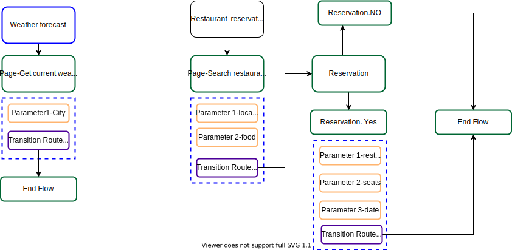

# Dialogflow-CX-Start-Tutorial

### Content
- ##### [Introduction](#intro)
- ##### [Dialogflow CX Setup ](#Setup)
- ##### [Creating a simple welcome message](#welcomemessage)
- ##### [Creating a single-flow agent](#single-flow)
- ##### [Creating multiple-flow agent](#multiple-flow)
- ##### [How reuse information from previous conversation turns](#reuseinformatione)
- ##### [Testing the completed agent](#Testing)
- ##### [Conclusion](#conclu)

## Introduction
This guide shows how to use the Dialogflow CX Console to build and test a simple demo agent. When interacting with this agent, you can ask for getting the weather forecast information, search for a restaurant and make a table reservation. Your completed agent for this guide will be graphed by the console like the following:

## Dialogflow CX Setup 
1. To use services provided by Google Cloud, you need to create a project using [Google Cloud Console](https://console.cloud.google.com/) and enable the Dialogflow API.
2. Using [DF-CX console](https://dialogflow.cloud.google.com/cx/projects), choose the project you just created and click Create agent. 
3. Complete the form for basic agent settings: 
   *You can choose any name. 
   *Select your preferred location.  
   *Select your preferred time zone. 
   *Select the default language for your agent. 
4. Click Save.  

## Exploring the created agent 
The created agent has a default Start Flow with a start page that comes with default welcome intent. Withing this default setting, the agent can handle a basic conversation with only a welcome message. 

To test your new agent:
1. Click the Test Agent button to open the simulator.
2. Enter hello in the text entry and press enter.
3. The agent responds with a default welcome response.
4. Close the simulator 

To edit the welcome response message:
1. Click the Build tab.
2. Select the Default Start Flow in the Flows section.
3. Click the Start node in the graph. This is the start page for the Default Start Flow.
4. Find the intent route with the Default Welcome Intent as an intent requirement and click it. This opens a panel to edit the intent route information.
5. Find the fulfillment section and delete all response messages, then add "Hello, this is a demo virtual agent. How can I help you? as the only response".
6. Click Save and Close the intent route editing panel.
7. Test the updated welcome response message

## Managing Flows & Pages
So far, the agent has one flow with the start page. In this section, we will add two flows that handle requests about the weather forecast and restaurant reservations. The design of these flows is like the following:

<b> Weather forecast flow: </b> allows users to ask about weather forecast information in a given city. Before build it let create the intent that once matched, the flow will be called to handle the user request. 
<b> Intent: </b> weather.current
<b> Parameter: city
<b> Entity type: geo-city
<b> Training utterances: [utterances.text] (https://github.com/hayo03/Dialogflow-CX-Start-Tutorial/blob/main/intents/SearchRestaurant.txt) 
To create the intent: 
  1. Select the Manage tab.
  2. Click Entity Types, click +Create, set the name to size geo-city, add these entity entries (Paris, Lyon, Evry, ) and click Save
  3. Click Intents, click Create, enter weather.current for the intent name and enter the training phrases in [utterances.text](https://github.com/hayo03/Dialogflow-CX-Start-Tutorial/blob/main/intents/SearchRestaurant.txt).
  4. For each phrase that contains a city, annotate the city with a city parameter and the @geo-city custom entity type.
  5. Click Save 

## Creating multiple-flow agent

## How reuse information from previous conversation turns?

## Testing the completed agent

## Conclusion

